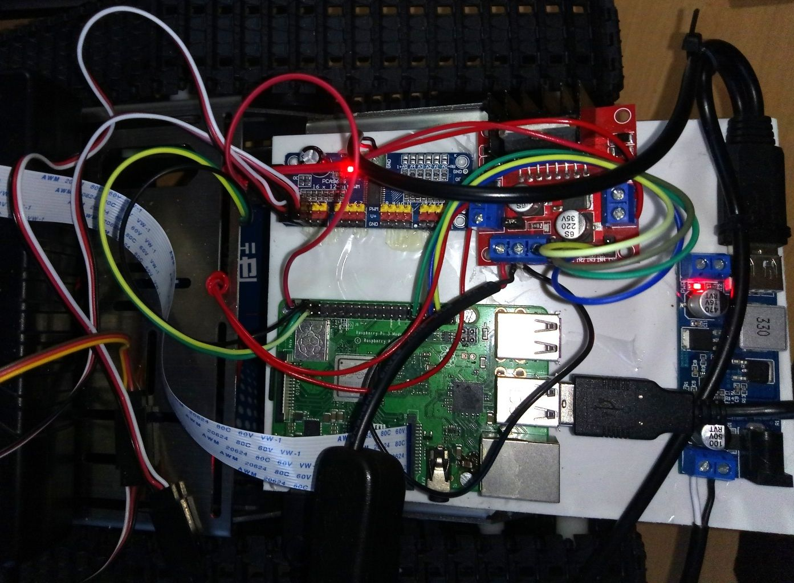
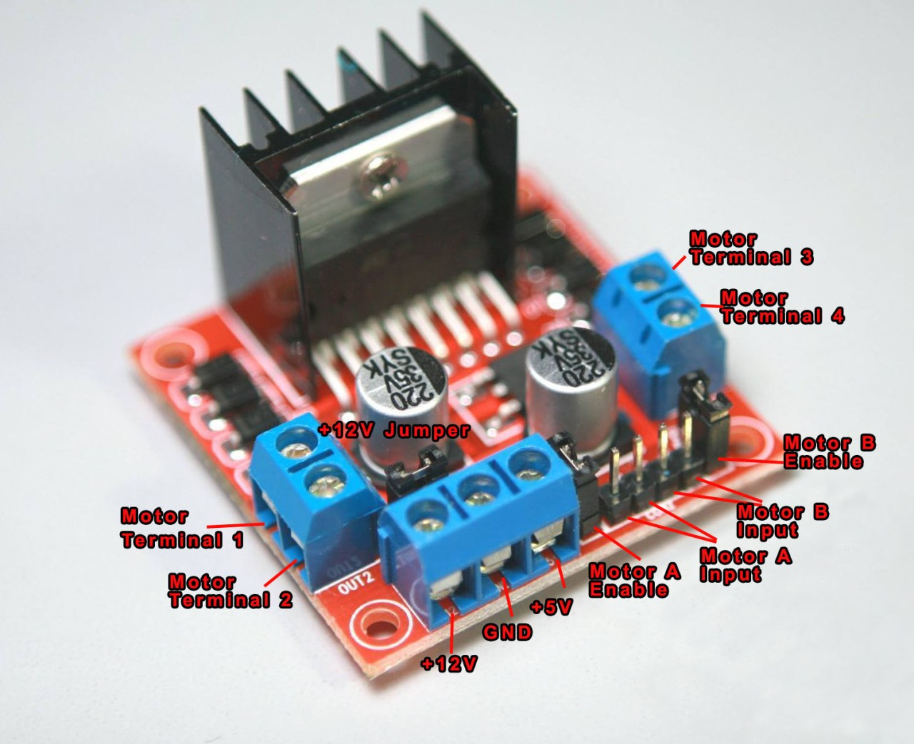
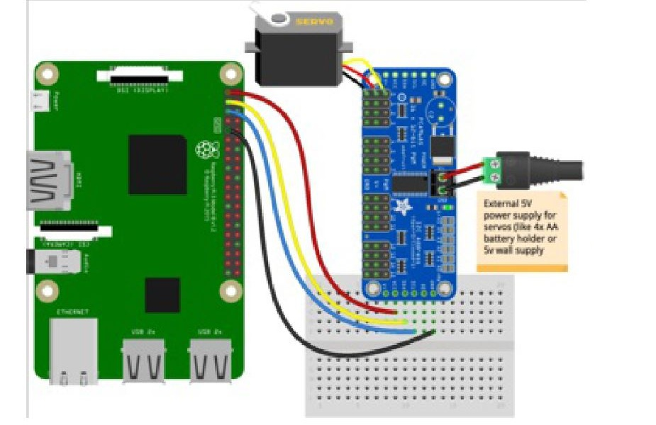
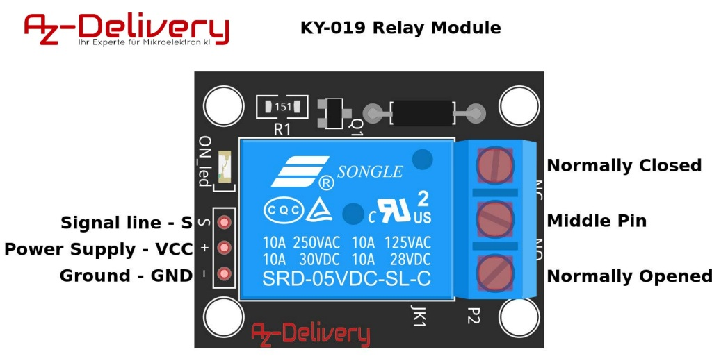
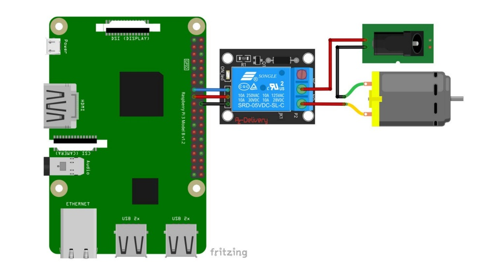

# Raspberry Pi stuff



## Todo

Servo hat on top of Raspberry - to save space?
<https://coolcomponents.co.uk/collections/raspberry-pi/products/16-channel-pwm-servo-hat-for-raspberry-pi>

Unidirect lidar
<https://coolcomponents.co.uk/products/tfmini-micro-lidar-module-qwiic-sen-14786?_pos=4&_sid=fa167a5d8&_ss=r>

Strom und Spannung anzeigen
<https://coolcomponents.co.uk/products/ads1015-24v-adc-breakout>

## Hardware extensions

learn.adafruit.com/adafruit-16-channel-pwm-servo-hat-for-raspberry-pi/connecting-servos
learn.adafruit.com/adafruit-16-channel-pwm-servo-hat-for-raspberry-pi/attach-and-test-the-hat

Single brushless driver www.adafruit.com/product/3190
learn.adafruit.com/adafruit-drv8871-brushed-dc-motor-driver-breakout/pinouts
learn.adafruit.com/adafruit-drv8871-brushed-dc-motor-driver-breakout/usage

Pi Camera Mount - www.adafruit.com/product/1434
GPIO reference label - www.adafruit.com/product/2263
Pimoroni Pan-Tilt HAT for Raspberry Pi - www.adafruit.com/product/3353

## Setup

raspian is debian stretch - now buster

## core libs

```bash
sudo apt-get update
sudo apt-get dist-upgrade
sudo apt-get install htop
sudo apt-get install vim
sudo apt-get install xterm

# converts htop to html
sudo apt-get install aha


# configure scripts for sudo rights
#   webserver log
#   restart webserver
#   sudo execute python script
#   execute htop
sudo visudo
```

```conf
username ALL = NOPASSWD: /home/pi/webserver/wsl.sh
username ALL = NOPASSWD: /home/pi/webserver/rest.sh
username ALL = NOPASSWD: /home/pi/webserver/stop.sh
username ALL = NOPASSWD: /home/pi/webserver/shutown.sh
username ALL = NOPASSWD: /home/pi/webserver/ifconfig.sh
username ALL = NOPASSWD: /home/pi/webserver/sudo-python.sh
username ALL = NOPASSWD: /home/pi/webserver/htop2html.sh
```

```bash
# connect via ZEW-Internal WLAN
ssh pi@10.1.1.60
# connect via ZEW guest WLAN
ssh pi@192.168.179.55
# connect via tp-link router
ssh pi@192.168.0.100
ssh pi@192.168.0.101
# connect smartphone wlan hotspot ??
ssh pi@192.168.43.41
# connect via ??
ssh pi@10.1.1.99

```

[Web interface via ZEW Guests](http://192.168.179.55)

[Web interface via ZEW-Internal](http://http://10.1.1.60/)

```bash

# test multi threading
start curl http://192.168.179.55/sleep --output out1.html
start curl http://192.168.179.55/sleep --output out2.html
start curl http://192.168.179.55/sleep --output out3.html

# configure stuff
# Enable I2 bus
sudo raspi-config

# sysinfo
uname -a

# reboot
sudo shutdown -r now
# shutdown
sudo shutdown    now

```

## Network configuration

### WLAN Router

[Admin UI](http://192.168.0.1/)
        admin
        admin
        (auch das Passwort ist 'admin')

We would need static DHCP - or our own DNS Server - Dnsmasq

MAC - 3rd Raspi

Wireless - Wireless statistics

| DNS           | MAC           | IP    |
| ------------- |:-------------:| -----:|
| NB-PBU-T480S  |  20:16:B9:2A:27:BD    |  192.168.0.100  |  01:55:17
| raspberrypi   |  B8:27:EB:42:58:8A    |  192.168.0.101  |  01:54:25

IP-MAC-Binding  - ARP
DHCP-Clients List

```bash
sudo service networking restart

ifconfig
hostname
sudo raspi-config
sudo iwlist wlan0 scan
sudo iwlist wlan0 scan
```

### WLAN raspberry client config

```conf
sudo vim /etc/network/interfaces
# add below to
sudo vim /etc/wpa_supplicant/wpa_supplicant.conf
sudo  rm /etc/wpa_supplicant/.wpa_supplicant.conf.swp
```

* Chose connections by `wpa_cli select_network 0`
or `wpa_cli select_network 1`

* Default priority of all networks is 0

* `priority=1` gets chosen above defaults

* `priority=2` gets chosen above `priority=1` and above defaults

```conf
ctrl_interface=DIR=/var/run/wpa_supplicant GROUP=netdev
update_config=1
country=DE

# network={
#         ssid="ZEW-Members"
#         psk="poseidoN"
#         key_mgmt=WPA-PSK
#         priority=1
# }

# prio 4 is highest
# prio 1 is lowest

network={
        ssid="TP-Link_C744"
        psk="[secret]"
        key_mgmt=WPA-PSK
        priority=1
}

network={
        ssid="ZEW-Guests"
        psk="[secret]"
        key_mgmt=WPA-PSK
        priority=2
}

network={
        ssid="MotoPowerG8"
        psk="[secret]"
        key_mgmt=WPA-PSK
        priority=3
}

network={
        ssid="ZEW-Internal"
        psk="[secret]"
        key_mgmt=WPA-PSK
        priority=4
}


```

<https://www.raspberrypi.org/forums/viewtopic.php?p=1007973>

## WLAN scanning guest WLAN

```bash

for ip in 192.168.{179..179}.{0..255}
do
        echo "<ip>${ip}</ip>"
        ssh pi@${ip}
done

```

## Python 3.7.x

step is obsolete now

### System measures

<https://elinux.org/RPI_vcgencmd_usage>

```bash
vcgencmd measure_volts  sdram_c
vcgencmd measure_volts  sdram_i
vcgencmd measure_volts  sdram_p
# temperature
vcgencmd measure_temp

vcgencmd measure_clock arm

# Turns off video output.
vcgencmd display_power 0
vcgencmd display_power 1
```

### Console juggling

```bash
# Webserver needs a console because of htop

# showing current console info
tty

# switch to other console - ends up switching the
sudo chvt 6
```

### Change MAC address

As of 2020-01 this failed, use ssh tunneling instead

```bash
# from the command line, you have to run
sudo ip link set dev  eth0 address fc:53:9e:a6:19:f0
sudo ip link set dev wlan0 address fc:53:9e:a6:19:f0

#  to make it permanent, within /etc/network/interfaces,
# add the following stanza to the eth0 block
sudo vim /etc/network/interfaces
pre-up ip link set dev  eth0 address fc:53:9e:a6:19:f0
pre-up ip link set dev wlan0 address fc:53:9e:a6:19:f0

sudo service networking restart
```

## Windows 10 ssh server

See `log-software.md` to install ssh server.

## ssh tunnel

this also failed - use ZEW guest WLAN

```bash
# https://ssh-tunnel.de/ssh-tunnel-mit-linux/
# ssh -L localport:zielrechner:dest_port -l username gateway/relais
# ssh -L 1119:news.uni-rostock.de:119    -l cb000 cksz.rz.uni-rostock.de

sudo ssh   -L 80:final-destinat:80      -l pbu   192.168.0.100
sudo ssh   -L 80:www.spiegel.de:80      -l pbu   192.168.0.100
sudo ssh   -L 443:0.0.0.0:443           -l pbu   192.168.0.100 &
sudo ssh   -L  80:0.0.0.0:80            -l pbu   192.168.0.100 &


#
# outgoing port can not be the problem - since we can ssh the router
# https://unix.stackexchange.com/questions/348829/how-to-list-all-open-ports-after-blocking-ports-using-iptables
sudo iptables -L
sudo /sbin/iptables -A INPUT -p tcp --dport 22 -j ACCEPT
sudo iptables -L
```

### USB Cam

Python picamera library is only for the official Raspberry Pi camera module connected to the CSI bus.

If you want to use regular USB Webcams , look at projects supporting V4L2:
<github.com/gebart/python-v4l2capture>

```bash
sudo apt-get install fswebcam

fswebcam             ./Pictures/cur-image1.jpg
fswebcam -r 1280x720 ./Pictures/cur-image2.jpg
fswebcam -r 1280x720 --no-banner ./Pictures/cur-image3.jpg

sudo pip install picamera
```

### Onscreen touch keyboard - virtual keyboard

```bash
sudo apt-get install matchbox-keyboard
sudo reboot
```

Menu >> Accessories >> Keyboard
Menu >> Zubehör     >> Tastatur

### Power supply

Buck power converter
Input  9-36 Volt
Output  5.2 Volt - 6 Ampere - 30 Watt

Supplies raspberry and servo.
Not the brushless motors.
__Short circuit !__

Raspberry is limited to 2.5 Ampere

### L298N Motor Drive Controller for DC motors



Needs *_separate_* power supply of 6-12 Volt

25 Watt

We have a jumper - and it is active

```bash
# copy dir python-gpiozero to control the brushed motors
tar -zcvf python-gpiozero.tar.gz python-gpiozero/

sudo python3 ./Documents/brush-4-gpiozero.py
```

### PWM 16-Servo-PWM Hat  - PCA9685 Servotreiber - servo motors

[Manual](PCA9685-16-channel-servo-driver-with-raspberry-pi.pdf)



```bash
# copy dir python-gpiozero to control the brushed motors
tar -zcvf python-gpiozero.tar.gz python-gpiozero/

# option1
sudo pip3 install adafruit-pca9685

# option2
# copy dir Adafruit_Python_PCA9685 to control the servo motors
tar -zcvf Adafruit_Python_PCA9685.tar.gz Adafruit_Python_PCA9685/

# option3
git clone github.com/adafruit/Adafruit_Python_PCA9685.git
cd Adafruit_Python_PCA9685/
sudo python setup.py install

sudo raspi-config
# Enable I2 bus

sudo apt-get install python-smbus
sudo apt-get install i2c-tools
sudo i2cdetect -y 1

# test
sudo python3 ./Adafruit_Python_PCA9685/examples/simpletest.py
sudo python3 ~/Documents/servo-2-calibrate.py
```

## Relais




Battery  red/positive to COM - common
DC Motor red/positive to N0

```python
import RPi.GPIO as GPIO
import time
import traceback

channel = 22

GPIO.setmode(GPIO.BCM)
GPIO.setup(channel, GPIO.OUT)


def relaisOn(pin):
        GPIO.output(pin, GPIO.HIGH)

def relaisOff(pin):
        GPIO.output(pin, GPIO.LOW)


if __name__ == '__main__':
    try:
        relaisOn(channel)
        time.sleep(10)
        relaisOff(channel)
        time.sleep(1)
    except Exception as e:
        print("camLoop: Problems starting camera")
        print(traceback.format_exc())
    finally:
        GPIO.cleanup()

```

## Tensor flow stuff

<https://github.com/EdjeElectronics/TensorFlow-Lite-Object-Detection-on-Android-and-Raspberry-Pi/blob/master/Raspberry_Pi_Guide.md>
Copy saved to TensorFlow-on-Raspberry-Pi.pdf

We now get openCV without the revolting compilation drudgery -
because `get_pi_requirements.sh` contains
`pip3 install opencv-python==3.4.6.27`

```bash
# update system
sudo apt-get update
sudo apt-get dist-upgrade

# download git repo
git clone https://github.com/EdjeElectronics/TensorFlow-Lite-Object-Detection-on-Android-and-Raspberry-Pi.git
mv TensorFlow-Lite-Object-Detection-on-Android-and-Raspberry-Pi tflite1
cd tflite1

# virtual environment operations
sudo pip3 install virtualenv
python3 -m venv tflite1-env
source tflite1-env/bin/activate
bash get_pi_requirements.sh
deactivate

# the magic fills the virtual environment with packages and compiles openCV
bash get_pi_requirements.sh
# packages in virtual environment dont require sudo

# the neural network
wget https://storage.googleapis.com/download.tensorflow.org/models/tflite/coco_ssd_mobilenet_v1_1.0_quant_2018_06_29.zip
unzip coco_ssd_mobilenet_v1_1.0_quant_2018_06_29.zip -d Sample_TFLite_model
python3 TFLite_detection_webcam.py --modeldir=Sample_TFLite_model

```

## OpenCV compilation - old

See opencv-compilation-stuff.md

## Dropbox app

www.dropbox.com/developers/apps/info/vmidd4r1h2rc42r
Appkey      vmidd4r1h2rc42r
AppSecret   a87li34eti3ddcz
AccessToken [secret]

## Dimensions of components

raspberry        8,50 x 5,60
        holes    5,80 x 4,90
motor driver     3,75 x 3,75
i2 servo driver  5,50 x 1,75
buck converter   5,40 x 2,90 - not the holes

camera arm       2,70 x 3,20 - ultra tiny screws

battery pack motor driver 7,10 x  6,00
battery pack motor usb    7,80 x 12,60

* display
  * Fläche 7,5 x 12
  * Bohrungen 8,70 - 11,25
  * Bohrungen sind 0,7 cm

## 3d printed robot chassis

upper pane        13,40 x 13,50
upper pane        13,40 x  6,70
step               3,00

<https://www.tinkercad.com/things/hLiJmnhdZim-raspberryfoundation01/edit>
<https://www.tinkercad.com/things/1vcCwlFRDQs-step02/edit>
<https://www.3dhubs.com/manufacture/>

[Cheepest service 2020-01-20 - 37 Euros](https://print.all3dp.com/material)

[Cheepest service 2020-04-12 - 26 Euros](https://www.treatstock.com/c/nologo-design?selectedPrinterId=4309&model3dViewedStateId=1383429)

Riser to live the front deck to the same height as the back deck


## Small external monitor

display
Kapazitiver 5 Zoll HDMI Touchscreen Monitor
800 x 480 HD-LCD-Bildschirm
<https://www.amazon.de/dp/B07YCBWRQP>

Raspberry Pi 3/3 B +

Needs RASPBIAN / UBUNTN / KAIL

```bash
sudo vim /boot/config.txt
```

```conf
max_usb_current = 1
Hdmi_group = 2
Hdmi_mode = 87
Hdmi_cvt 800 480 60 6 0 0 0
```

## golang libaries

### gobot

[I2C-bus written in Golang](https://github.com/d2r2/go-i2c)

[also](https://gobot.io/documentation/platforms/raspi/)

[Driving the servos via I2P](https://gobot.io/documentation/drivers/pca9685/)

[PWM without C code](https://github.com/stianeikeland/go-rpio)

PWM gobot recommendation PiBlaster has C dependencies
    echo "17=1" > /dev/pi-blaster
    <https://github.com/sarfata/pi-blaster>

## xterm error

if you get error "childprocess xterm could not be found"

sudo apt-get install xterm

## autostart webserver - reset GPIOs - gpio init service

<https://www.certdepot.net/rhel7-get-started-systemd/>

```bash
systemd-analyze critical-chain
```

```conf
[Unit]
Description=GPIO-init
# After=basic.target
After=sysinit.target

[Service]
ExecStart=sudo /usr/bin/python3 -u /home/pi/Documents/gpio-init.py
WorkingDirectory=/home/pi/Documents
StandardOutput=inherit
StandardError=inherit
# Restart=always
User=pi

[Install]
# WantedBy=basic.target
WantedBy=sysinit.target
```

It kicks in far too late - no use.
We need a hardware switch :(

```bash
sudo vim /etc/systemd/system/gpio-init.service
sudo systemctl start   gpio-init.service
sudo systemctl status  gpio-init.service

sudo systemctl enable  gpio-init.service
```

### webserver service

better use Apache WSGI with flask?

```bash
# prepare log
mkdir /home/pi/webserver
sudo touch /var/log/webserver.log
sudo chown pi:pi   /var/log/webserver.log


# run webserver without service
LOG_DIRECT='1000'
# so child processes can see
export LOG_DIRECT
echo "$LOG_DIRECT"
# check
sudo --preserve-env python3 -c "import os; print(os.environ.get('LOG_DIRECT', 'Nonesuch'))"
# run
sudo --preserve-env python3 webserver.py


# install as service
#
# This does not work with my syslog / rsyslog
# touch /etc/rsyslog.d/webserver.conf
# sudo vim   /etc/rsyslog.d/webserver.conf
# if $programname == 'websrvapp' then /var/log/webserver.log
# & stop
#
#
# insert config below
sudo vim /etc/systemd/system/webserver.service
sudo systemctl daemon-reload
sudo systemctl enable  webserver.service
#
sudo systemctl restart  webserver.service
sudo systemctl start    webserver.service
sudo systemctl status   webserver.service


# run as service
sudo systemctl daemon-reload && sudo systemctl restart  webserver.service
tail    /var/log/webserver.log
tail -f /var/log/webserver.log  --lines=40
```

```conf
[Unit]
Description=WebServer
After=network-online.target

[Service]
Type=simple
Environment="One=1" "Three=3" "RUNNINGASSERVICE=true"
ExecStart=sudo /usr/bin/python3 -u /home/pi/webserver/webserver.py
ExecStop=/bin/true
# have python finally executed: raspberrypi.stackexchange.com/questions/77738/
# otherwise use type notify with github.com/systemd/python-systemd
KillSignal=SIGINT
WorkingDirectory=/home/pi/webserver
Restart=always
User=pi
# bind to a port below 1024
# CapabilityBoundingSet=CAP_NET_BIND_SERVICE
# AmbientCapabilities=CAP_NET_BIND_SERVICE
# to execute *htop* via subprocess.run, we need a console
TTYPath=/dev/tty6
StandardInput=tty
StandardOutput=tty
# consequentiall - all stuff below does not work
# StandardOutput=inherit
# StandardError=inherit
# StandardOutput=/var/log/webserver.log
# StandardError=/var/log/webserver.log
# SyslogIdentifier=websrvapp
# StandardOutput=syslog
# StandardError=syslog

[Install]
WantedBy=multi-user.target
```

### Fixing bug on restart

```conf
...
cam: loop started
Exception in thread Thread-2:
Traceback (most recent call last):
  File "/usr/lib/python3/dist-packages/picamera/camera.py", line 1704, in capture_continuous
    'Timed out waiting for capture to end')
picamera.exc.PiCameraRuntimeError: Timed out waiting for capture to end

```

### webserver port 80 privileges

<https://serverfault.com/questions/112795/how-to-run-a-server-on-port-80-as-a-normal-user-on-linux>

```bash
sudo apt-get install libcap2-bin
sudo setcap 'cap_net_bind_service=+ep' /usr/bin/python3
sudo setcap 'cap_net_bind_service=+ep' /usr/bin/python3.7
```

### OpenCV video stream

[Source](https://www.pyimagesearch.com/2019/09/02/opencv-stream-video-to-web-browser-html-page/)

```bash
# this destroyed the opencv installation
sudo pip3 install imutils
# in venv
sudo pip  install imutils

tflite1-env: sudo pip install imutils

pip3 install flask # lightweight multithreading Python webserver

# either
sudo apt-get install python3-opencv
# or
pip3 install opencv-contrib-python
pip3 install imutils
```

### Systemd stuff

<https://www.certdepot.net/rhel7-get-started-systemd/>

```bash
# analyze boot
systemd-analyze

systemd-analyze blame

systemd-analyze critical-chain

# specific target
systemd-analyze critical-chain sysinit.target | grep target

systemctl list-dependencies

systemctl list-dependencies sshd.service

# control groups
systemd-cgls

# kill all associated procs
systemctl kill httpd

# get/set resource limit
systemctl show -p CPUShares httpd.service
systemctl set-property httpd.service CPUShares=500

# list
systemctl list-unit-files

# failed at boot
systemctl --failed

# show
systemctl show httpd
systemctl show webserver.service
systemctl edit webserver.service --full

# run levels
systemctl rescue
# current run level
systemctl get-default

# users, date time locale hostname
loginctl list-users
timedatectl
localectl
hostnamectl


systemctl poweroff
systemctl reboot
```

## Journal stuff

```bash
sudo journalctl -b               # since reboot
sudo journalctl --since -10m
sudo journalctl --since "2020-04-08 13:46:00"  --until "2020-12-08 13:46:00"
sudo journalctl --unit webserver.service
sudo journalctl -u webserver.service --since "2020-04-08 13:46:00"
sudo journalctl -u webserver.service --since today
sudo journalctl -u webserver.service --since -2m

sudo systemctl daemon-reload

sudo systemctl restart  webserver.service
sudo systemctl start    webserver.service
sudo systemctl status   webserver.service

sudo systemctl enable   webserver.service

# put together
sudo systemctl daemon-reload && sudo systemctl restart  webserver.service
sudo journalctl -u webserver.service --since -2m
```

## Autostart desktop app

<https://www.raspberrypi-spy.co.uk/2014/05/how-to-autostart-apps-in-rasbian-lxde-desktop/>

```bash
# all users
# older path  /etc/xdg/lxsession/LXDE/autostart
sudo vim /etc/xdg/lxsession/LXDE-pi/autostart
```

```conf
@lxpanel --profile LXDE
@pcmanfm --desktop --profile LXDE
@/usr/bin/chromium-browser --noerordialogs --disable-session-crashed-bubble --disable-infobars --kiosk http://localhost
@xscreensaver -no-splash@
```

```bash
# depending on logged in user
vim ~/.config/lxsession/LXDE-pi/autostart

# test
startx
 ```

```conf
@~/mcpi/minecraft-pi
@/usr/bin/python /home/pi/example.py
@/usr/bin/chromium-browser --noerordialogs --disable-session-crashed-bubble --disable-infobars --kiosk http://localhost
@lxterminal
@leafpad
@galculator
```


##  2024-09

raspberrypi	B8-27-EB-42-58-8A	192.168.1.102	23:51:43

### dynDNS

Not needed - mobile providers use IP address for multiple customers and block any incoming connection

pbberlin.zapto.org:8080
pbberlin.zapto.org:8081


```bash
# username is *pbu* not pi
# password is Pb....
# ssh login - no password needed

ssh pbu@192.168.1.102


# not needed
sudo apt purge --auto-remove wolfram*
sudo apt purge --auto-remove libreoffice*
sudo apt purge --auto-remove libopencv*


# updating the debian version
sudo apt-get update
sudo apt-get upgrade
sudo reboot
sudo apt-get dist-upgrade
sudo reboot


```

### Desktop display

* on the GUI
* preferences
* Screen Configuration
    800x600 works best, the display has 800x4..


### wayland and wayland VNC

before rpi-connect

```bash

# some settings from raspi-config
sudo nano /boot/firmware/config.txt


# uninstall if necessary
sudo apt remove rpi-connect


# DISABLE VNC server before switching to wayland
sudo raspi-config
# interface options
# => enable VNC server
sudo reboot


# now change backend
sudo raspi-config
# advanced options
# => switch to wayfire
sudo reboot

# now enable VNC server
sudo raspi-config
# interface options
# => enable VNC server
sudo reboot


# => switch to the other VNC server
sudo reboot

# => now
sudo shutdown -h 0

```

### wayland troubleshooting

```bash

sudo apt install weston xwayland
sudo apt install wayvnc

# not running
# sudo systemctl status   weston.service
sudo systemctl list-unit-files *vnc*

 

# see which service is running

sudo systemctl list-unit-files

sudo systemctl list-unit-files *vnc*

sudo systemctl status   wayvnc.service
sudo systemctl start    wayvnc.service
sudo systemctl enable   wayvnc.service

journalctl -u wayvnc


sudo systemctl status  wayvnc-control.service
sudo systemctl status  wayvnc-generate-keys.service

sudo systemctl status   vncserver-virtuald.service
sudo systemctl stop     vncserver-x11-serviced.service
sudo systemctl disable  vncserver-x11-serviced.service
sudo systemctl status   vncserver-x11-serviced.service


# check for wayland backend
# diagnostics

loginctl
# write down the session ids of col "SESSION"
#   for instance 1, 2 or 4
loginctl show-session <SESSION_ID> -p Type
loginctl show-session 1 -p Type
loginctl show-session 3 -p Type


echo $WAYLAND_DISPLAY
echo $XDG_SESSION_TYPE
ps -e | grep -i wayland

journalctl -xe
#  ep 22 17:25:56 raspberrypi systemd[1]: Started wayvnc.service - VNC Server.
#  ep 22 17:25:56 raspberrypi systemd[1]: Started wayvnc-control.service - VNC Control Service.


journalctl -xe | grep wayland


# this fails
weston --tty=1


```


### Remote connect

```bash


#  https://www.raspberrypi.com/software/connect/
#  https://www.raspberrypi.com/documentation/services/connect.html

sudo apt install rpi-connect

loginctl enable-linger
systemctl --user daemon-reload
systemctl --user restart rpi-connect.service


systemctl --user start rpi-connect
rpi-connect signin

rpi-connect vnc on
rpi-connect status

systemctl --user status    rpi-connect
systemctl --user stop      rpi-connect
systemctl --user start     rpi-connect
systemctl --user disable   rpi-connect

journalctl --user --follow --unit rpi-connect --unit rpi-connect-wayvnc
journalctl -xe


# https://connect.raspberrypi.com/devices

#  * Deaktiviere den VNC-Server über raspi-config
#  * aktiviere diesen danach wieder!
#       Anderenfalls wird der zuletzt aktivierte Server immer starten, in dem Fall der WayVNC-Server.

```


#### Trash - related to wayland problem

```bash
sudo apt update
sudo apt install weston xwayland

sudo nano /boot/firmware/config.txt
# old
dtoverlay=vc4-fkms-v3d
# new
dtoverlay=vc4-kms-v3d
```


### MediaServer - DONT 

* openmediavault was a huge conglomerate of node, python and PHP.
* it only works on the non-desktop version of Raspian
* I think over complicated and does not provide much use for home media


[openmediavault installieren](https://carsten-nichte.de/docs/mediaserver-mit-raspberry-pi/)
[auch](https://www.openmediavault.org/screenshots.html)

=> Benötigt Raspian __lite__  - ohne Desktop

https://wiki.omv-extras.org/doku.php?id=omv7:raspberry_pi_install


* Jellyfin Webclient - Media server


### Utils

```bash
sudo apt-get install htop
sudo apt-get install vim
sudo apt-get install screen
sudo apt-get install matchbox-keyboard


# https update
sudo apt install apt-transport-https
```

## Wiring of cables

The Display needs a _direct_ USB slot, but not one of the blue ones

If the display is "pumping" then check the that power supply mini USB is _next_ to the HTML.
See picture

Everything else, also the SSD can go to the USB-Hub connected to

![assembly-2024-09-22.jpg]


### SSD Disk via USB

```bash
# gparted

sudo apt-get install ntfs-3g
sudo apt-get install gparted
# does not exist anymore?
sudo apt-get install exfat-utils
# this is essential
sudo apt-get install exfat-fuse

# disconnect SSD
# reboot
# connect SSD
# rescan devices using GParted
# => T7 is now under T71
# seems the mountpoint was blocked

# gparted reports errors
# => "scan" the disk under windows - resolve errors


# => T7 SSD is now under /media/pbu/T7


#-----------------

# there were problems with T7
# maybe one needs to insert it _after_ boot?


```

## [FileBrowser](https://github.com/filebrowser/filebrowser)

<https://github.com/filebrowser/filebrowser>

```bash


cd  ~/filebrowser

filebrowser config set --auth.method=noauth
filebrowser config set --auth.method=json


filebrowser config set --root=/media/pbu/T7/dropbox-24-09/
filebrowser config set --port=8081
filebrowser config set -a 0.0.0.0
filebrowser config set -l ~/filebrowser/fb.log


filebrowser users -h
filebrowser users add     pbu  Pb....
filebrowser users update  pbu  --perm.admin
filebrowser config set --branding.name=pbu-media

filebrowser cmds ls 


# switching into screen
screen -S filebrowser

# taking setting from above
filebrowser 

# explicit settings
filebrowser -r /media/pbu/T7/dropbox-24-09/ -a 0.0.0.0  -p 8081
# [CTRL-A][D]

screen -ls
screen -r filebrowser


```

*  Commands (triggered on events) can be added under [Global Setting](http://192.168.1.102:8081/settings/global)

* Command executable in the "shell" view of the browser must be  
  configured in the advance [user settings](http://192.168.1.102:8081/settings/users/2)


## Webserver

sudo apt-get install apache2

document root ist
/var/www 


sudo systemctl status   apache2.service


## Photoprism auf Raspberry Pi

Remove previous failed stuff

```bash
# removing containers, volumes, networks AND IMAGES:
sudo docker system prune -a

# better
sudo docker rm pbu_photoprism_1

# no volumes
sudo docker volume ls


# in ~/storage   and everywhere:
rm .ppignore
rm .ppstorage
```

Clean state

```bash
# as normal user
wget https://dl.photoprism.app/docker/arm64/docker-compose.yml

nano docker-compose.yml
# only edit volume pointing to the original files / sources; i.e.
#     - "/media/pbu/T7/dropbox-24-09/img:/photoprism/originals"
# edit the admin user name and password


# cd to docker-compose.yml
cd ~
sudo docker-compose up -d

sudo docker-compose up -d

# check logs
sudo docker-compose logs -f --tail=100


# bad - use commands below
#  DONT USE -start
sudo docker ps -a
sudo docker stop  pbu_photoprism_1
sudo docker stop  pbu_mariadb_1
sudo docker start pbu_photoprism_1
sudo docker start pbu_mariadb_1
#  DONT USE -end


```

Wait 50 secs and call

[check UI 1](http://localhost:2342/)

[check UI 2](http://192.168.1.102:2342/)


### Updating - restarting of Photoprism

[see](https://docs.photoprism.app/getting-started/updates/)

```bash
docker compose pull
docker compose stop
docker compose up -d
```

[adding folders](https://docs.photoprism.app/getting-started/advanced/docker-volumes/)


[docker compose commands](https://docs.photoprism.app/getting-started/docker-compose/) - start and stop etc.

It seems, that folders can only be added at creation time?
I added:
    - "/media/pbu/T7/dropbox-24-09/video:/photoprism/originals/video"
and restarted, but nothing happened

I tried to add ~/storage/config/options.yml
        it was found upon restart - but the multi line syntax was rejected

## ngrok

<https://ngrok.com>

```bash
mkdir ngrok
cd ngrok
wget https://bin.equinox.io/c/bNyj1mQVY4c/ngrok-v3-stable-linux-arm64.tgz

sudo tar -xvzf ~/ngrok/ngrok-v3-stable-linux-arm64.tgz -C /usr/local/bin

ngrok config add-authtoken 76pggRKnEJWhQQdJnMRHP_2NuUArqX1QTGsmSvtW4Tc


# screen -S your_session_name
screen -S ngrok
# ngrok http --domain=merry-mosquito-cool.ngrok-free.app 80
ngrok http --domain=merry-mosquito-cool.ngrok-free.app   80
ngrok http --domain=merry-mosquito-cool.ngrok-free.app 2342
ngrok http --domain=merry-mosquito-cool.ngrok-free.app 8081
# [CTRL-A][D]

screen -ls
screen -r ngrok

```

[access from everywhere](https://merry-mosquito-cool.ngrok-free.app/)


## ngrok and filebrowser as systemd service

instead of screen

```bash

# sudo systemctl edit --force --full your-service-name.service
  
  sudo systemctl edit --force --full filebrowser.service


[Unit]
Description=file browser
After=network.target

[Service]
User=pbu
ExecStart=/usr/local/bin/filebrowser
WorkingDirectory=/home/pbu/filebrowser

Restart=on-failure
StandardOutput=journal
StandardError=journal

[Install]
WantedBy=multi-user.target


sudo systemctl daemon-reload
sudo systemctl stop    filebrowser.service
sudo systemctl start   filebrowser.service
sudo systemctl status  filebrowser.service
sudo systemctl enable  filebrowser.service

```


#### ngrok service

```bash

  sudo systemctl edit --force --full ngrok.service


[Unit]
Description=ngrok remote access
After=network.target

[Service]
User=pbu
ExecStart=/usr/local/bin/ngrok  http --domain=merry-mosquito-cool.ngrok-free.app 8081
WorkingDirectory=/home/pbu/ngrok

Restart=on-failure
StandardOutput=journal
StandardError=journal

[Install]
WantedBy=multi-user.target


sudo systemctl daemon-reload
sudo systemctl stop    ngrok.service
sudo systemctl start   ngrok.service
sudo systemctl status  ngrok.service
sudo systemctl enable  ngrok.service

```


